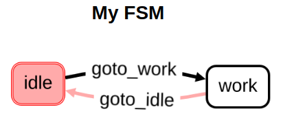

# my_ros2_transitions

Combination of ROS2 and PyTransitions (Finit-State-Machine).

||
|:-:|
||


## Requirements

```
transitions==0.8.9
transitions-gui==0.1.0
tornado==6.1
```

## Notice

The blocking execution of rclpy is the major problem.
